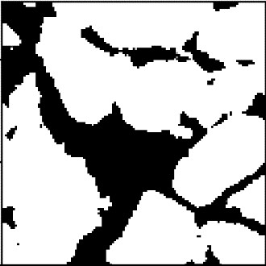

# SRCNN-FSRCNN-to-Enhance-Digital-Rock-Image-Resolutions

This repository is implementation of the ["Accelerating the Super-Resolution Convolutional Neural Network"](https://arxiv.org/abs/1608.00367).

## Differences from the original

- Added the zero-padding
- Used the Adam instead of the SGD

## Requirements

- PyTorch 1.8.1+cu111
- Numpy 1.21.6
- Pandas 1.3.5
- h5py 3.1.0
- tqdm 4.65.0
- matplotlib 3.1.0
- imageio 2.28.1
- tabulate 0.9.0

## Dataset

Q01 dataset converted to HDF5 which is located in db folder.

## Code Utils.py

In this code, all necessary functions used for network training and testing are defined.

## Code Dataset.py

In this code, class Image_Dataset is defined, which can be used to load the images inside Q01.h5 and seperate the low-resolution images under the title x from the high-resolution images under the title y and use the dataset.

## Code Model.py

In this code, Model FSRCNN is defined that the FSRCNN is different from SRCNN mainly in three aspects. 
First, FSRCNN adopts the original low-resolution image as input without bicubic interpolation. A deconvolution layer is introduced at the end of the network to perform upsampling. 
Second, the non-linear mapping step in SRCNN is replaced by three steps in FSRCNN, namely the shrinking, mapping, and expanding step. 
Third, FSRCNN adopts smaller filter sizes and a deeper network structure. 
These improvements provide FSRCNN with better performance but lower computational cost than SRCNN.

## Code Train.py

In this code, how to train the network is defined.

## Code Test.py

In this code, how to test the network is defined.

## Results

PSNR was calculated on the single channel.

| Eval. Mat | Scale | SRCNN | Modified-SRCNN1 | Modified-SRCNN2 | FSRCNN |
|-----------|-------|-------|-----------------|-----------------|--------|
| PSNR | 2 |   34.94   |            35.15            |            35.39            |    35.85     |
| SSIM | 2 |  0.9513  |           0.9521           |           0.9532           |   0.9545    |

<table>
    <tr>
        <td>
Low-Resolution Image
</td>
        <td>
Reconstructed Image with SRCNN
</td>
        <td>
Reconstructed Image with FSRCNN
</td>
        <td>
High-Resolution Image
</td>
    </tr>
    <tr>
    	<td>
    		

    	</td>
    	<td>
    		

    	</td>
    	<td>
    		

        </td>
        </td>
    		

    	</td>
    </tr>
</table>
